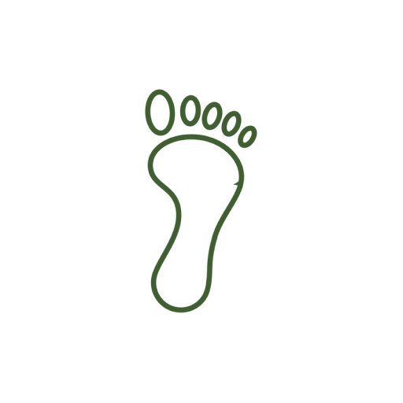
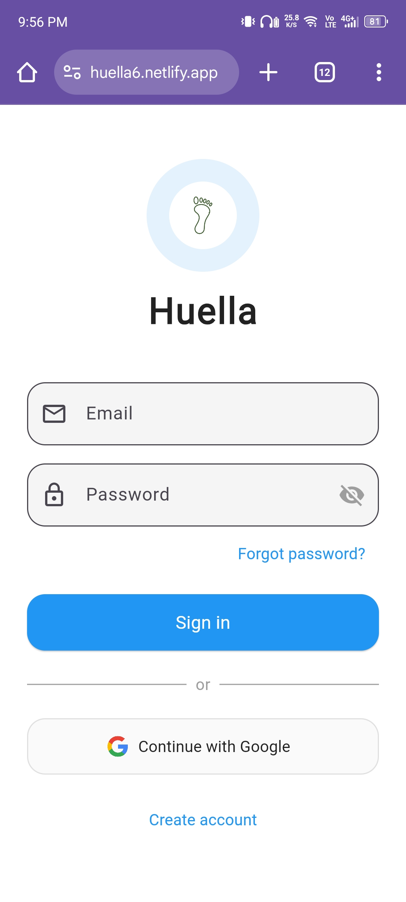
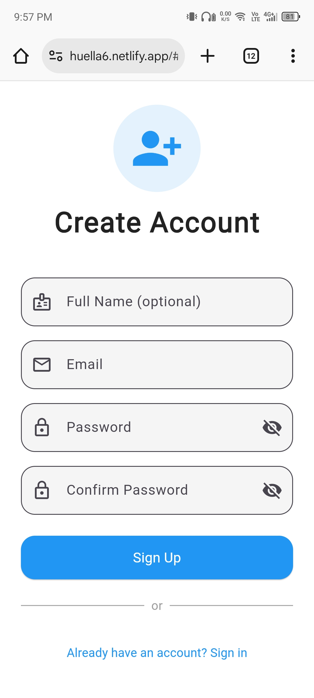
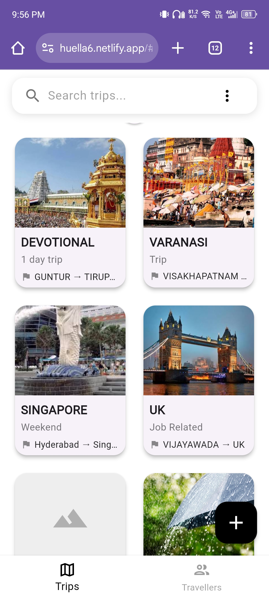
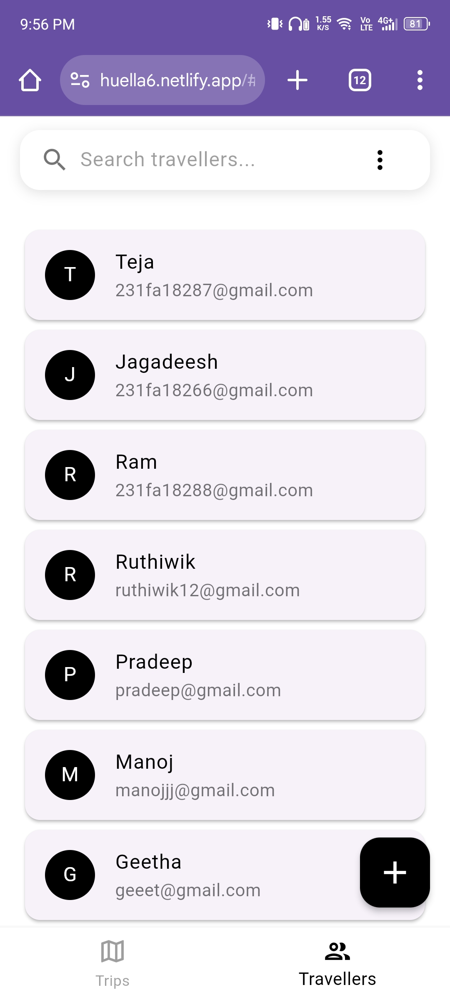
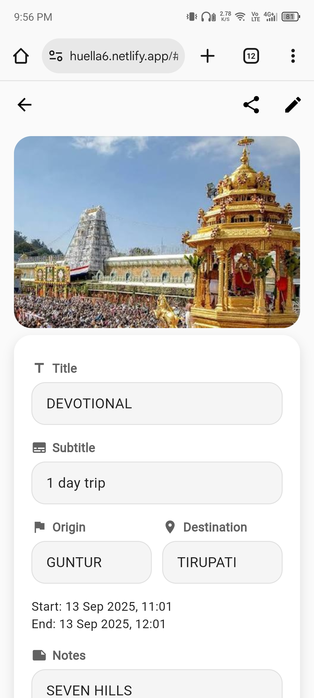
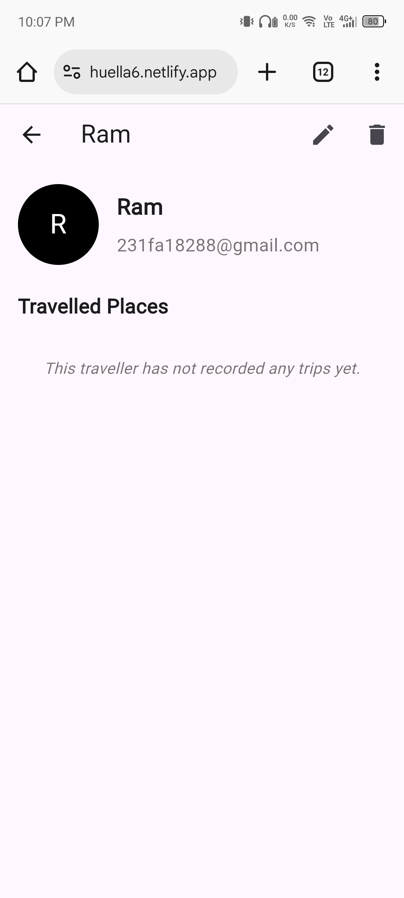
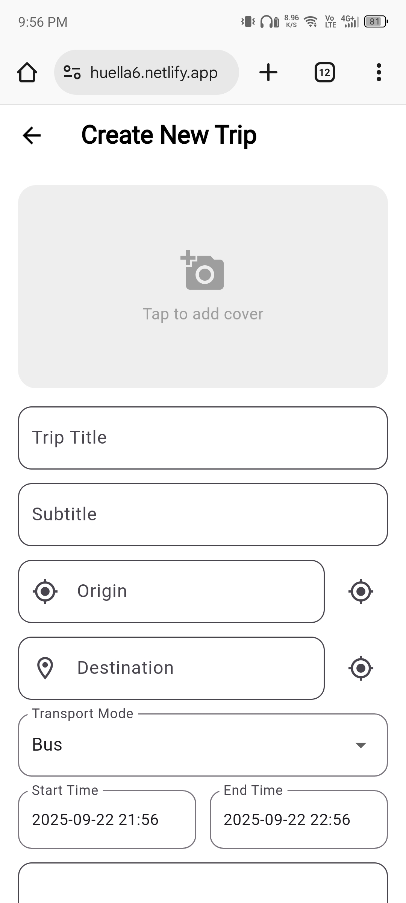
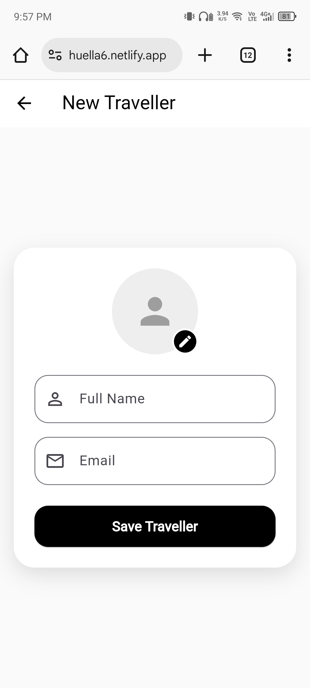

  

<h1 align="center">Huella - Trip Data Collect</h1>

A Flutter application to **create, manage, and share trips** with travellers.  
You can add trip details, upload a cover image, track origin/destination, and view trip details with travellers list.

---

## ✨ Features

- Create new trips with:
  - Title, subtitle, origin, destination, notes
  - Start & end times
  - Transport mode selection
  - Travellers selection
  - Cover image upload (supports Web & Mobile)
- View trip details with:
  - Cover image (with shimmer loading effect)
  - Trip information (origin → destination, notes, times)
  - List of travellers (with profile picture or initials)
- Edit trip details directly from detail page
- Share trip details using native share dialog
- Firestore integration for storing trips & travellers

---

## 🛠️ Tech Stack

- **Flutter** (UI framework)
- **Dart** (programming language)
- **Firebase Firestore** (cloud database)
- **Image Picker** (select cover images)
- **ImgBB** (image hosting via API)
- **Geolocator** (fetch current location for origin/destination)
- **Share Plus** (share trip details)
- **Shimmer Animation** (loading effect for images)

---

## 📸 Screenshots

  
  

  
  

  
  

  
  

---

## 🧑‍💻 Contributing

Fork the repo
Create a feature branch (git checkout -b feature-name)
Commit changes (git commit -m "Added feature XYZ")
Push to your branch (git push origin feature-name)
Create a Pull Request 🚀

---

## 📜 License

This project is licensed under the MIT License.
